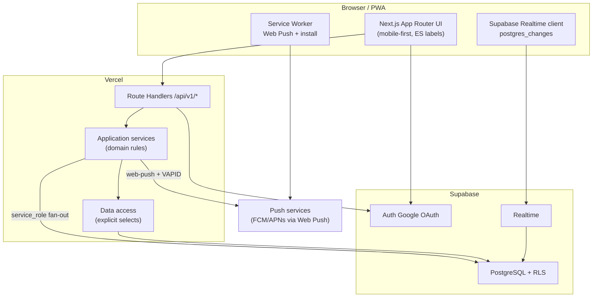

# Kortumo — Implementation Plan

Derived from `spec.md` (approved API, RLS, push), `constitution.md`, and **`Brandbook-KORTUMO.pdf`**.  
Working folder remains `call-up/`; **product brand in UI = Kortumo** (mark **K**).  
**No application feature code in this document** (brand tokens / structure notes only).

---

## 0. Brand & product naming (Kortumo)

Source: **`Brandbook-KORTUMO.pdf`** (repo root). Package docs: `call-up/docs/brand.md`, tokens `call-up/lib/brand/kortumo.ts`.

| Topic | Decision |
|-------|----------|
| **Product name (UI)** | **Kortumo** — not “Call Up” in user-visible chrome |
| **Mark** | Stylized **K** (`public/brand/logo-k.svg`); PWA icons from same mark |
| **Repo / package path** | Keep `call-up/` for now (rename later if desired) |
| **Domain language** | Spec terms stay (`callup`, `caller`, API `/callups`) — English in code; Spanish labels in UI |

### Palette (brandbook)

| Token | Hex | Role |
|-------|-----|------|
| Soft blue | `#6699ff` | Accents / links |
| Navy | `#003366` | Primary brand, headers |
| Red | `#cc3333` | Primary CTAs / emphasis |
| Teal | `#339999` | Secondary / positive |
| White | `#ffffff` | Surfaces |

Inspired by regulation multicancha colors (brandbook).

### Typography

| Role | Brandbook | Web (until licensed files) |
|------|-----------|----------------------------|
| Titles | Aharoni Bold | Montserrat Bold |
| Body | Open Sans | Open Sans |
| Light UI | Montserrat Light | Montserrat Light |
| Chrome | Myriad Pro | Open Sans |

### Voice

Rápido y seguro · Confiable · Pensado para ti. Simple, accesible, fluido — encuentro y pasión por el juego.

### UI visual rules (Phase 4)

- Brand-first: **K / Kortumo** is a hero-level signal on landing (not only nav text).
- Mobile-first; Spanish copy.
- Prefer navy + white surfaces; red for primary CTAs; soft blue / teal for secondary states.
- Hero imagery may use brandbook court/stadium references under `public/brand/reference/`.
- Avoid generic purple-AI themes; follow Kortumo swatches above.
- **Landing CTAs (US-001):** primary label **Creador de Convocatoria (Caller)** (home only); secondary **Soy jugador**. Mobile: `min-h-14` + `py-3.5` (or equivalent ≥56px / ≥14px padding), full-width stacked; do not use a short fixed `h-12` that starves padding when labels wrap.
- **Ready caller on `/` (US-001/002 MUST):** session with profile complete + `userName` → **client redirect to `/caller`** (dashboard). Incomplete → `/complete-profile`; caller without slug → `/complete-caller-username`. OAuth `intent=caller` already resolves to `/caller` via `resolvePostAuthRedirect`; do not leave ready callers on the marketing landing. Logout → `/`.
- **Roster lists (US-005/009):** payment column header **💵** (never text “Ya pagó” in UI); admin adds edit/delete symbol headers; truncate player names; Inscribir must not reflow list height **nor exceed viewport width** (overlay + `max-w-full` / no horizontal overflow); edit-name UI same width rule; ≥16px on inputs only as secondary Safari hygiene.

---

## 1. Architecture Overview

### High-level architecture



### Layered structure

| Layer | Location (planned) | Responsibility |
|-------|--------------------|----------------|
| **UI** | `app/**`, `components/**` | Pages, Spanish labels, Suspense skeletons, Realtime toasts, PWA UX |
| **API** | `app/api/v1/**` | HTTP, Zod parse, auth gate, Problem Details + `traceId` |
| **Application** | `lib/services/**`, `lib/rules/**` | Callup eligibility, status transitions, claim/promote, notify fan-out |
| **Data** | `lib/db/**`, repositories | Typed queries (no `SELECT *`), RLS session client vs `service_role` |

Constitution: path-based routes, layered UI / API / data, single responsibility per module.

### Rationale

- **Next.js fullstack + Vercel** — constitution host/stack; Route Handlers match approved `/api/v1` contract.
- **Supabase Auth + Postgres + RLS** — Google login, public channel reads, owner writes; Realtime via **`postgres_changes`** (spec §11 / **§11.7 MUST** for live roster UI — not optional polish).
- **Web Push in Route Handlers** — background delivery (US-011); sync fan-out OK for ~50-user pilot.
- **Domain services over fat handlers** — TDD and 80% coverage gate target application rules/validators, not pages.

---

## 2. Technology Stack Justification

| Technology | Role | Constitution / spec alignment | Approval |
|------------|------|-------------------------------|----------|
| **Next.js** (App Router) + **TypeScript** | Fullstack UI + API | Explicit stack | Already in repo |
| **React** | UI | Comes with Next | Built-in |
| **Tailwind CSS** | Styling, mobile-first | Explicit | Already expected |
| **Zod** | Request/body validation at server boundary | Explicit | Already expected |
| **Jest** | Unit tests; `npm test` | Explicit | Already expected |
| **@supabase/supabase-js** + **@supabase/ssr** | Auth session, DB, Realtime | Postgres/Supabase + Realtime | **Approved / installed** |
| **web-push** | VAPID Web Push send (server) | PWA / push requirement | **Approved** |
| **Playwright** (or equivalent) | E2E smoke per major flow | Testing pyramid | **ASK FIRST** |
| **date-fns-tz** / **Temporal** (pick one) | America/Bogota comparisons | Spec TZ | **ASK FIRST** |
| **Next.js official PWA + manual SW** | `app/manifest` + `public/sw.js` (push / notificationclick) | Constitution PWA guide; install + Web Push MVP | **Approved** — no Serwist / next-pwa |

**Not chosen:** Serwist / `@ducanh2912/next-pwa` (offline-first plugins). Revisit only if offline caching becomes a requirement.

**Env (never in client except public):** `NEXT_PUBLIC_SUPABASE_URL`, `NEXT_PUBLIC_SUPABASE_ANON_KEY`, `SUPABASE_SERVICE_ROLE_KEY`, `NEXT_PUBLIC_VAPID_PUBLIC_KEY`, `VAPID_PRIVATE_KEY`, `VAPID_SUBJECT`.

**Not used:** SQLite — constitution mandates **Postgres / Supabase**. Prompt asked for “SQLite tables”; see §7.

---

## 3. Folder Structure

Naming: **lowercase** file/folder names (`page.tsx`, `login.tsx`); code/docs English; UI copy Spanish.

```text
call-up/
├── public/
│   ├── sw.js                    # manual Service Worker (push + notificationclick)
│   ├── icons/                   # PWA icons (Kortumo K — 192 / 512)
│   └── brand/
│       ├── logo-k.svg           # K mark
│       └── reference/           # brandbook imagery (hero / courts)
├── app/
│   ├── manifest.ts              # web app manifest — name Kortumo
│   ├── layout.tsx               # fonts + brand CSS variables
│   ├── page.tsx                 # US-001 landing (Kortumo hero)
│   ├── (auth)/...
│   ├── caller/                  # US-004 dashboard
│   ├── [username]/              # public channel /{username}
│   ├── callups/[id]/
│   ├── profile/
│   ├── complete-profile/
│   ├── complete-caller-username/
│   ├── not-found.tsx / error.tsx
│   └── api/v1/
│       ├── auth/google/route.ts
│       ├── auth/callback/route.ts
│       ├── auth/logout/route.ts
│       ├── me/...
│       ├── callups/...
│       ├── callers/[userName]/...
│       └── courts/...
├── components/                  # shared UI (Kortumo-styled)
│   ├── brand/                   # LogoK, BrandMark
│   ├── ui/
│   ├── channel/                 # FollowButton (Seguir / No Seguir)
│   ├── callup/
│   └── skeletons/
├── lib/
│   ├── brand/                   # kortumo.ts tokens
│   ├── constants/               # enums, limits (no magic numbers)
│   ├── validators/              # Zod schemas
│   ├── rules/                   # eligibility, status, name-match
│   ├── services/                # application actions
│   ├── notify/                  # web-push fan-out
│   ├── db/                      # supabase clients + repos
│   ├── auth/
│   ├── pwa/                     # register-sw, subscribe-push
│   └── errors/                  # Problem Details helpers
├── supabase/migrations/         # SQL + RLS (ask before change)
├── __tests__/ or colocated *.test.ts
├── constitution.md
├── spec.md
└── plan.md
```

| Folder | Purpose |
|--------|---------|
| `app/` | Routes + Route Handlers |
| `components/` | Presentational / interactive UI |
| `lib/rules` + `lib/services` | TDD focus — domain + orchestration |
| `lib/db` | Persistence; explicit column lists |
| `supabase/migrations` | Schema/RLS; constitution **ASK FIRST** |

---

## 4. Data Models

### Spec → technical mapping

| Spec entity | Table | Notes |
|-------------|-------|-------|
| Users | `users` | `id` = `auth.users.id`; `user_name` nullable until caller |
| Callup_Channel | `callup_channels` | `link` = `/{user_name}` |
| Player_Subscriptions | `player_subscriptions` | follow; unique `(player_user_id, caller_user_id)` |
| Callups | `callups` | status `Open\|Full\|Closed\|cancelled` |
| Courts | `courts` | name UNIQUE normalized UPPERCASE |
| Caller_Courts | `caller_courts` | PK `(caller_user_id, court_id)` |
| Players | `players` | roster/waitlist via `is_wait_list` |
| (push §11) | `push_subscriptions` | unique `endpoint` |

### Field types, validations, constraints (Postgres)

```sql
-- Conceptual DDL (PostgreSQL / Supabase — not SQLite)
-- Enums as text + check or native enum

users (
  id uuid PK REFERENCES auth.users,
  email text NOT NULL,
  name text NOT NULL CHECK (char_length(name) <= 100),
  phone text NULL CHECK (phone ~ '^[0-9]{10}$'),  -- required when profileComplete
  user_name text NULL UNIQUE CHECK (user_name ~ '^[a-z0-9-]{5,10}$'),
  avatar_url text NULL,
  created_at timestamptz NOT NULL DEFAULT now()
)

callup_channels (
  id uuid PK,
  caller_user_id uuid NOT NULL UNIQUE REFERENCES users,
  link text NOT NULL  -- '/{user_name}'
)

player_subscriptions (
  player_user_id uuid NOT NULL REFERENCES users,
  caller_user_id uuid NOT NULL REFERENCES users,
  channel_id uuid NOT NULL REFERENCES callup_channels,
  PRIMARY KEY (player_user_id, caller_user_id),
  CHECK (player_user_id <> caller_user_id)  -- no self-follow
)

callups (
  id uuid PK,
  caller uuid NOT NULL REFERENCES users,
  court_id uuid NOT NULL REFERENCES courts,
  court_type text NOT NULL CHECK (court_type IN ('F5','F6')),
  match_at timestamptz NOT NULL,
  spots_quantity int NOT NULL CHECK (spots_quantity BETWEEN 1 AND 30),
  wait_list boolean NOT NULL,
  wait_list_threshold int NOT NULL,  -- floor(spots/2) at create; immutable
  payment_key text NOT NULL CHECK (char_length(payment_key) <= 50),
  status text NOT NULL CHECK (status IN ('Open','Full','Closed','cancelled')),
  created_at timestamptz NOT NULL DEFAULT now()
)

courts (
  id uuid PK,
  created_by uuid NOT NULL REFERENCES users,
  name text NOT NULL UNIQUE,  -- trimmed UPPERCASE normalized
  address text NOT NULL CHECK (char_length(address) <= 100)
)

caller_courts (
  caller_user_id uuid NOT NULL REFERENCES users,
  court_id uuid NOT NULL REFERENCES courts,
  PRIMARY KEY (caller_user_id, court_id)
)

players (
  id uuid PK,
  callup_id uuid NOT NULL REFERENCES callups,
  created_at timestamptz NOT NULL DEFAULT now(),  -- FIFO promote
  name text NOT NULL,
  has_payment boolean NOT NULL DEFAULT false,
  user_id uuid NULL REFERENCES users,
  is_wait_list boolean NOT NULL DEFAULT false
  -- UNIQUE partial: one row per user_id per callup when user_id NOT NULL
  -- Guest uniqueness enforced in app (normalized name) + optional unique index
)

push_subscriptions (
  id uuid PK,
  user_id uuid NOT NULL REFERENCES users,
  endpoint text NOT NULL UNIQUE,
  p256dh text NOT NULL,
  auth text NOT NULL,
  user_agent text NULL,
  created_at timestamptz NOT NULL DEFAULT now(),
  updated_at timestamptz NOT NULL DEFAULT now()
)
```

**App validations (Zod):** phone 10 digits; `paymentKey` max 50, no whitespace, email-allowed charset; username `[a-z0-9-]{5,10}`; courts search min length 3; claim/guest name trim + case-insensitive, **no** accent folding.

**RLS:** per spec §10; `service_role` only for revalidate lock + push recipient load/send.

---

## 5. API Implementation Plan

Base: `/api/v1`. Session identity from cookie — never trust client `userId` for self. JSON camelCase. Dates ISO-8601; business TZ `America/Bogota`.

### Endpoints (from spec §9)

| Method | Path | Auth |
|--------|------|------|
| GET | `/auth/google` | anon |
| GET | `/auth/callback` | anon |
| POST | `/auth/logout` | session |
| GET / PATCH | `/me` | session |
| POST | `/me/username` | session |
| POST / DELETE | `/me/push-subscription` | session |
| GET | `/callups/mine` | caller |
| GET | `/callers/{userName}/callups` | anon |
| GET | `/callups/{id}` | anon |
| POST | `/callups` | caller |
| PUT | `/callups/{id}` | owner |
| PATCH | `/callups/{id}/revalidate-status` | session |
| POST | `/callups/{id}/cancel` | owner |
| GET | `/courts?search=` | caller |
| POST | `/courts` | caller |
| POST | `/courts/{id}/link` | caller |
| PUT | `/courts/{id}` | createdBy |
| POST | `/callups/{id}/players/subscribe` | session (deferred on public UI MVP) |
| POST | `/callups/{id}/players/guests` | **anon or session** (Inscribir MVP) |
| POST | `/callups/{id}/players/me/unsubscribe` | session |
| DELETE | `/callups/{id}/players/{playerId}` | owner |
| PATCH | `/callups/{id}/players/{playerId}` | owner |
| PATCH | `/callups/{id}/players/{playerId}/payment` | session |
| POST | `/callups/{id}/players/{playerId}/promote` | session |
| POST / DELETE / GET | `/callers/{userName}/follow` | session |

### Request / response shapes (representative)

Success: `{ "data": { ... } }` or paginated `{ "data": { "items", "pageIndex", "pageSize", "totalCount" } }`.

**POST `/callups` body**

```json
{
  "courtId": "uuid",
  "courtType": "F5",
  "spotsQuantity": 10,
  "waitList": true,
  "matchAt": "2026-08-01T20:00:00-05:00",
  "paymentKey": "@nequi123",
  "subscribeMyself": false
}
```

**GET `/callups/{id}` data** — status, matchAt, courtType, spots, waitList, threshold, paymentKey, court, counts, `subscribeEligibility`, `players[]` (no email/phone).

**POST subscribe body:** `{ "acceptWaitlist": false }` → `201` player DTO or `409` + `WAITLIST_CONFIRM_REQUIRED` / `CALLUP_FULL` / `SPOT_TAKEN_FIFO`.

Full DTO field lists: **spec §9** (source of truth).

### Error handling

```json
{
  "type": "about:blank",
  "title": "Conflict",
  "status": 409,
  "detail": "Mensaje en español para el usuario",
  "traceId": "uuid",
  "code": "CALLUP_FULL"
}
```

- Log Problem Details + `traceId`; never stack traces to clients.
- FE unhandled → **"Oops, algo salió mal"**; handled → Spanish `detail`.
- Custom `not-found` / error pages (Next.js).
- Approved `code` enum: spec §9 Conventions.

**Side effects after mutations:** recompute status (`Open`/`Full`/`Closed`); notify per §11 (followers + owner except `new_callup` → followers only; claim → no notify; payment → caller only).

---

## 6. Testing Strategy

Aligned with constitution Testing Requirements.

### Unit (Jest — default)

| Layer | What |
|-------|------|
| `lib/rules` | Eligibility, Full/Open/Closed transitions, waitlist threshold, name normalize/claim, PaymentKey, spots F5/F6 |
| `lib/validators` | Zod schemas |
| `lib/services` | subscribe / promote / cancel / revalidate with mocked DB + notify |
| API mappers | Problem Details shape, `traceId` |
| Notify | recipient resolution (followers + owner; no claim; no self-follow) |

Mock Supabase/Realtime/network in unit CI. Coverage gate: **≥80% line/branch** on domain services, rules, validators only.

### Integration (selective)

- Critical repos against local Supabase/Postgres: unique guest name, last-spot race, promote FIFO, RLS smoke (own row vs channel scope).
- OAuth callback upsert path with test doubles if full Google E2E is heavy.

### E2E smoke (Playwright)

At least one path per major flow: landing CTAs; caller Google → username → create callup; player enters slug → `/{username}` **without** Google → **Inscribir** guest; two devices see live roster (Realtime); follow → permission prompt path (may stub Notification); cancel → read-only.

### Test data

- Factories: user (player vs caller), callup Open/Full/Closed/cancelled, roster/waitlist fixtures.
- Fixed Bogota timestamps for past/future Closed tests.
- Deterministic names for claim (`"Pepe"` vs `"pepe "`).

TDD: red → green → refactor on application logic and API contracts before next feature.

---

## 7. Assumptions Made

| # | Assumption | Validate? |
|---|------------|-----------|
| A1 | **Postgres/Supabase**, not SQLite (constitution wins over prompt wording) | Confirm |
| A2 | App lives under existing `call-up/` Next project (no new repo) | Confirm |
| A3 | `users.id` mirrors `auth.users.id`; trigger/callback upsert | Confirm |
| A4 | Guest uniqueness via app transaction + optional unique index on normalized name | Confirm schema approach |
| A5 | Follow already-following → idempotent success (not 409) | Soft |
| A6 | **PWA = Next.js official + manual `public/sw.js`** (no Serwist/next-pwa). Manifest via `app/manifest.ts`. Register SW from client; push on follow per spec §11 | **Closed** |
| A6b | **`web-push` npm package approved** for server VAPID send | **Closed** |
| A7 | Push fan-out synchronous in request for pilot (~50 users); queue later if needed | Soft |
| A8 | `new_callup` push skips creating caller; other churn includes owner | Spec §11 — confirm copy |
| A9 | Route `app/[username]` for public channel; dashboard under `/caller` | Soft |
| A10 | Exact PaymentKey regex charset as listed in spec conventions | Soft |
| A11 | Installing listed **ASK FIRST** packages requires human OK before `npm install` | Constitution |
| A12 | Physical migration SQL applied only after human approval | Constitution ASK FIRST |
| A13 | **UI brand = Kortumo** (K mark) per `Brandbook-KORTUMO.pdf`; folder may stay `call-up/` | **Closed** |
| A14 | Aharoni/Myriad substituted with Montserrat/Open Sans until license files arrive → **Task 22** | Soft → Task 22 |
| A15 | Official K vector replaces stand-in `logo-k.svg` in Task 22 (prerequisite: asset drop) | Soft → Task 22 |
| A16 | **US-008/009:** open `/{username}` without Google; **anon = Inscribir** (guest); **logged-in = Inscribirme** (subscribe/`userId=me`); self-promote when on waitlist | Spec Changed 2026-07-30 → **Task 23** + revised **Task 27** |
| A17 | **Live roster MUST** via `postgres_changes` + `supabase_realtime` publication (`players`, `callups`) — not “later polish” | Spec §11.7 → **Task 24** |
| A18 | Home CTA: **Creador de Convocatoria (Caller)** + **Soy jugador**; mobile CTAs `min-h-14` / `py-3.5` (US-001) | Spec Changed 2026-07-30 |
| A19 | **Administrar** route `/callups/{id}` (US-005) delivered in Task 25 baseline | Spec US-005 → Task 25 |
| A20 | **Roster UI:** payment **💵**; admin edit/delete symbols; truncate; Inscribir overlay without width overflow; **Inscribirme** + Promoverme for session users | Spec US-005/009 → Tasks 26–27 |
| A21 | **Ready caller visiting `/` → `/caller`** (dashboard); CTA checks session before Google; logout stays `/` | Spec US-001/002 → Task 28 |

---

## Implementation order (suggested)

### Done (API / PWA — Tasks 1–16)

1. Schema draft + RLS → auth/me/username  
2. Courts + create/edit callup + mine list  
3. Public channel APIs + subscribe/guests/payment/promote  
4. Revalidate/cancel + status Full/Closed  
5. Follow + push_subscriptions + recipients + **manual SW / manifest**  
6. Coverage gate + docs  

### Phase 4 — UI screens (next)

7. **Brand tokens + landing** (US-001) — Kortumo K hero, role CTAs  
8. **Auth / profile / username** complete flows (US-002, US-010)  
9. **Caller dashboard** `/caller` (US-004) + share link (US-007)  
10. **Create / edit callup + courts search** (US-003a/b, US-006)  
11. **Public channel** `/{username}` + Seguir (US-008 baseline, US-011) — Task 21  
11a. **US-008/009 agile enroll (MVP pivot)** — no Google on `/player`; **Inscribir** guests only; anon `POST …/guests` — Task 23  
11b. **Realtime live roster (MUST, spec §11.7)** — browser `postgres_changes` + publication; AC: two devices see Inscribir without refresh — Task 24  
11c. **Administrar callup (US-005) baseline** — `/callups/{id}` owner manage UI — Task 25  
11d. **Roster mobile UX + enroll polish (US-005/009)** — after approved tasks:
    - Public `player-roster`: header **Nombre | 💵**; truncate names; **anon → Inscribir** (guest sheet); **logged-in → Inscribirme** (`POST …/subscribe`, no name form); **Promoverme** when own waitlist row and roster spot free.
    - Admin `admin-roster`: headers **Nombre | 💵 | pencil | trash**; fixed action columns; truncate names; **Inscribir** in bottom sheet (no list reflow / no width overflow); **Promover** waitlist → roster when spot free.
    - Do **not** link `userId` on guest Inscribir for logged-in users — self identity comes only from **Inscribirme**.
11e. **Caller home → dashboard redirect (US-001/002)** — (1) `app/page.tsx` gate: ready caller (`profileComplete` + `userName`) → `replace("/caller")`. (2) **Creador de Convocatoria** CTA: on click check session first (same gates); only start Google OAuth when there is no session. Logout → `/`. (3) PWA `manifest.start_url` **MUST stay `/`** — never `/caller` (forced-login regression for anon PWA open). Unauthenticated `/caller` → `/`.
11f. **PWA install CTA (§11.8)** — **Instalar app** on `/` (secondary, below role CTAs) and public `/{username}`; Chromium `beforeinstallprompt`; iOS instruction sheet (Share → Agregar a pantalla de inicio); hide when already standalone.
12. Realtime **toast** copy polish + E2E smokes (later; builds on 11b)  
13. **Brand polish (Task 22)** — official K vector + Aharoni Bold (**blocked** until files delivered)  

**Do not implement until schema/deps approved where constitution requires ASK FIRST.**  
**Do not implement 11d / 11e / 11f until tasks are approved.**

See `tasks.md` Phase 4 (**Tasks 17–29**). Task 22 remains asset-gated. **Next implementable (after task approval):** **27 → 28 → 29** (PWA install).
