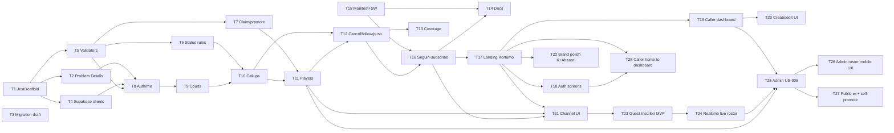

# Call Up — Task Breakdown

Source: `plan.md`, `spec.md`, `constitution.md`.  
Paths are under the existing Next app root: `call-up/`.  
**Do not install new deps or apply DB migrations without human approval** (constitution ASK FIRST).

Vertical-slice note: Core phase tasks are ordered so each feature can be finished (rules → service → route → tests for that slice) before the next feature starts. Dependencies list hard blockers only.

---

## Phase 1 — Setup

### Task 1 — Test runner and lib scaffolding
- **Description:** Configure Jest with `npm test` as the canonical command and create empty layered folders matching `plan.md` (`lib/constants`, `validators`, `rules`, `services`, `db`, `errors`).
- **Files Created/Modified:** `call-up/package.json`, `call-up/jest.config.ts`, `call-up/lib/.gitkeep` (or placeholder `index.ts` files), `call-up/README.md` (test script note only)
- **Acceptance Criteria:**
  - [x] `npm test` runs and exits 0 with zero tests (or a trivial smoke test)
  - [x] Folders `lib/constants`, `lib/validators`, `lib/rules`, `lib/services`, `lib/db`, `lib/errors` exist
  - [x] No production feature code beyond placeholders
- **Time Estimate:** 25 min
- **Dependencies:** None

### Task 2 — Problem Details helper
- **Description:** Implement RFC 7807 Problem Details builder with `traceId` and Spanish `detail` passthrough for API/logging alignment with constitution and spec §9.
- **Files Created/Modified:** `call-up/lib/errors/problem-details.ts`, `call-up/lib/errors/problem-details.test.ts`, `call-up/lib/constants/error-codes.ts`
- **Acceptance Criteria:**
  - [x] Helper returns `type`, `title`, `status`, `detail`, `traceId`, optional `code`
  - [x] Approved codes from spec exist as constants/enum (e.g. `CALLUP_FULL`, `SPOT_TAKEN_FIFO`)
  - [x] Unit tests cover success shape and default `traceId` generation
  - [x] No stack traces included in the payload
- **Time Estimate:** 30 min
- **Dependencies:** Task 1

### Task 3 — Postgres schema + RLS migration draft
- **Description:** Author the initial Supabase/Postgres migration for tables and RLS from plan §4 / spec §10 (users, channels, follows, callups, courts, players, push_subscriptions). **Do not apply** until human approval.
- **Files Created/Modified:** `call-up/supabase/migrations/0001_init.sql`, `call-up/supabase/migrations/0001_rls.sql` (or single file), `call-up/docs/schema-approval.md`
- **Acceptance Criteria:**
  - [x] DDL covers all entities in plan §4 including checks for status `Open|Full|Closed|cancelled`
  - [x] Self-follow prevented (`player_user_id <> caller_user_id`)
  - [x] RLS policies match spec §10 principles (no global users/callups list)
  - [x] `docs/schema-approval.md` states “awaiting human approval before apply”
- **Time Estimate:** 45 min
- **Dependencies:** None (can parallel Task 1–2)

### Task 4 — Supabase clients (session + service role)
- **Description:** Add typed Supabase browser/server clients and a server-only `service_role` factory for revalidate lock and push fan-out (keys from env only).
- **Files Created/Modified:** `call-up/lib/db/supabase-server.ts`, `call-up/lib/db/supabase-service.ts`, `call-up/.env.example`
- **Acceptance Criteria:**
  - [x] `.env.example` lists required vars without secret values
  - [x] `service_role` client is only importable from server modules (documented / path convention)
  - [x] Session client uses anon key + user JWT pattern
  - [x] No secrets hardcoded in source
- **Time Estimate:** 30 min
- **Dependencies:** Task 1; **`@supabase/supabase-js` / `@supabase/ssr` installed** (+ `server-only`)

---

## Phase 2 — Core Features

### Task 5 — Domain constants + Zod validators
- **Description:** Encode shared limits and Zod schemas for username, phone, PaymentKey, spots (1–30), court search min length 3, and callup create/edit bodies from spec §9.
- **Files Created/Modified:** `call-up/lib/constants/callup.ts`, `call-up/lib/validators/profile.ts`, `call-up/lib/validators/callup.ts`, `call-up/lib/validators/callup.test.ts`
- **Acceptance Criteria:**
  - [x] Username `[a-z0-9-]{5,10}` validated
  - [x] Phone exactly 10 digits; PaymentKey max 50, no whitespace, email-allowed charset
  - [x] `spotsQuantity` 1–30; court `search` min 3 rejected below that
  - [x] Unit tests green via `npm test`
- **Time Estimate:** 35 min
- **Dependencies:** Task 1

### Task 6 — Callup eligibility and status rules
- **Description:** Pure functions for subscribe eligibility and status transitions (`Open` ↔ `Full`, `Closed` by past `matchAt`, never overwrite `cancelled`) in America/Bogota terms.
- **Files Created/Modified:** `call-up/lib/rules/subscribe-eligibility.ts`, `call-up/lib/rules/callup-status.ts`, `call-up/lib/rules/callup-status.test.ts`, `call-up/lib/constants/status.ts`
- **Acceptance Criteria:**
  - [x] Eligibility true iff free roster OR (waitlist on and under threshold)
  - [x] No capacity ⇒ recommended status `Full`; past match ⇒ `Closed`
  - [x] `cancelled` is sticky in revalidate helper
  - [x] Unit tests cover Open/Full/Closed/cancelled cases with fixed timestamps
- **Time Estimate:** 40 min
- **Dependencies:** Task 5

### Task 7 — Player name-match, claim, and promote rules
- **Description:** Implement guest name normalization (trim, collapse spaces, case-insensitive, no accent folding), claim detection, and promote race winner by `createdAt` FIFO.
- **Files Created/Modified:** `call-up/lib/rules/player-name.ts`, `call-up/lib/rules/claim.ts`, `call-up/lib/rules/promote.ts`, `call-up/lib/rules/player-name.test.ts`
- **Acceptance Criteria:**
  - [x] `" Pepe "` matches `"pepe"`; `"José"` does not match `"Jose"`
  - [x] Claim = existing guest same normalized name + `userId` null
  - [x] Promote FIFO: earlier `createdAt` wins; loser modeled as `SPOT_TAKEN_FIFO`
  - [x] Unit tests cover claim vs new-row and concurrent promote ordering
- **Time Estimate:** 40 min
- **Dependencies:** Task 5

### Task 8 — Auth + profile API slice (vertical)
- **Description:** Wire Google OAuth start/callback/logout and `GET/PATCH /me` + `POST /me/username` (creates channel link) using validators and Problem Details.
- **Files Created/Modified:** `call-up/app/api/v1/auth/google/route.ts`, `call-up/app/api/v1/auth/callback/route.ts`, `call-up/app/api/v1/me/route.ts`, `call-up/app/api/v1/me/username/route.ts`
- **Acceptance Criteria:**
  - [x] Unauthenticated `GET /me` → `401` Problem Details with `traceId`
  - [x] Username set once; second set → `409` `USERNAME_IMMUTABLE` or `USERNAME_TAKEN` as appropriate
  - [x] Success envelopes use `{ data: ... }` camelCase
  - [x] Logout clears session (`204`)
  - [x] Contract tests or handler tests assert status + Problem Details shape
- **Time Estimate:** 45 min
- **Dependencies:** Task 2, Task 4, Task 5

### Task 9 — Courts API slice (search / create / link)
- **Description:** Implement `GET /courts`, `POST /courts`, `POST /courts/{id}/link`, `PUT /courts/{id}` with name normalization UPPERCASE and createdBy-only edit.
- **Files Created/Modified:** `call-up/app/api/v1/courts/route.ts`, `call-up/app/api/v1/courts/[id]/route.ts`, `call-up/app/api/v1/courts/[id]/link/route.ts`, `call-up/lib/services/courts.ts`
- **Acceptance Criteria:**
  - [x] Search with `< 3` chars → `400` `VALIDATION_ERROR`
  - [x] Create normalizes name and links `caller_courts`
  - [x] Link on select is idempotent `204`
  - [x] Non-owner PUT → `403` `NOT_COURT_OWNER`
  - [x] No `GET /courts/mine` endpoint exists
- **Time Estimate:** 45 min
- **Dependencies:** Task 8 (caller session)

### Task 10 — Callups create / mine / detail / edit slice
- **Description:** Implement create callup (threshold snapshot, optional `subscribeMyself`), `GET /callups/mine`, `GET /callups/{id}`, `PUT /callups/{id}` using eligibility/status rules.
- **Files Created/Modified:** `call-up/app/api/v1/callups/route.ts`, `call-up/app/api/v1/callups/mine/route.ts`, `call-up/app/api/v1/callups/[id]/route.ts`, `call-up/lib/services/callups.ts`
- **Acceptance Criteria:**
  - [x] Create sets `waitListThreshold = floor(spotsQuantity/2)` server-side
  - [x] `subscribeMyself` inserts roster row only when true
  - [x] Mine returns only session caller’s callups, newest first, page size 10 default
  - [x] Edit blocked when `cancelled` or `Closed`; spots ≥ roster or `SPOTS_BELOW_ROSTER`
  - [x] Public DTO omits email/phone
- **Time Estimate:** 45 min
- **Dependencies:** Task 6, Task 9

### Task 11 — Players subscribe / guests / promote / payment slice
- **Description:** Implement player endpoints: subscribe (claim silent), guests, unsubscribe, delete, patch name, payment, promote—with first-commit-wins on last roster spot and notify hooks stubbed or real.
- **Files Created/Modified:** `call-up/app/api/v1/callups/[id]/players/subscribe/route.ts`, `call-up/app/api/v1/callups/[id]/players/guests/route.ts`, `call-up/lib/services/players.ts`, `call-up/lib/services/players.test.ts`
- **Acceptance Criteria:**
  - [x] Roster full + waitlist available without `acceptWaitlist` → `409` `WAITLIST_CONFIRM_REQUIRED`
  - [x] Claim attaches `userId` and does **not** call channel notify
  - [x] Promote sets `isWaitList=false`, `hasPayment=false`; race loser → `SPOT_TAKEN_FIFO`
  - [x] Payment on guest only by owner; self allowed when `userId` matches
  - [x] Service unit tests cover claim-no-notify and promote FIFO with mocks
- **Time Estimate:** 45 min
- **Dependencies:** Task 7, Task 10

### Task 12 — Cancel, revalidate, follow, and push-subscription slice
- **Description:** Add cancel + thread-safe revalidate-status; follow/unfollow (reject self-follow); register/delete push subscription; recipient resolver for §11 (followers + owner, skip claim/`new_callup` to creator).
- **Files Created/Modified:** `call-up/app/api/v1/callups/[id]/cancel/route.ts`, `call-up/app/api/v1/callups/[id]/revalidate-status/route.ts`, `call-up/app/api/v1/callers/[userName]/follow/route.ts`, `call-up/app/api/v1/me/push-subscription/route.ts`, `call-up/lib/notify/recipients.ts`
- **Acceptance Criteria:**
  - [x] Cancel → `cancelled` irreversible; further churn mutations return `CALLUP_READ_ONLY`
  - [x] Revalidate: past → `Closed`; no capacity → `Full`; else `Open`; never clears `cancelled`
  - [x] Self-follow → `403` `FORBIDDEN`
  - [x] `recipients.ts` unit tests: owner included for subscribe; excluded for `new_callup`; claim path not used
  - [x] Push subscription POST upserts by `endpoint` (`204`)
- **Time Estimate:** 45 min
- **Dependencies:** Task 10, Task 11; **`web-push` approved** — install when wiring server send

---

## Phase 3 — Polish

### Task 13 — Coverage gate for domain layer
- **Description:** Raise unit coverage on `lib/rules`, `lib/validators`, and `lib/services` to meet the constitution ≥80% line/branch gate; exclude pages/assets from the gate config.
- **Files Created/Modified:** `call-up/jest.config.ts`, `call-up/lib/rules/*.test.ts` (gap fills only), `call-up/lib/services/*.test.ts`, `call-up/docs/coverage.md`
- **Acceptance Criteria:**
  - [x] Coverage config excludes `app/**/page.tsx` and static assets
  - [x] Reported coverage for rules/validators/services ≥ 80% lines and branches
  - [x] `npm test` is green in CI-equivalent local run
  - [x] `docs/coverage.md` records the command and last measured %
- **Time Estimate:** 40 min
- **Dependencies:** Task 6, Task 7, Task 11, Task 12

### Task 14 — README and API map documentation
- **Description:** Document how to run the app, required env vars, test command, and a concise endpoint map pointing to `spec.md` §9 as contract source of truth.
- **Files Created/Modified:** `call-up/README.md`, `call-up/docs/api.md`, `call-up/docs/local-setup.md`
- **Acceptance Criteria:**
  - [x] README lists setup, `npm test`, and link to `constitution.md` / `spec.md` / `plan.md`
  - [x] `docs/api.md` lists all `/api/v1` routes from Task 8–12 with auth level
  - [x] `docs/local-setup.md` documents Google OAuth + Supabase + VAPID placeholders
  - [x] No secrets committed; references `.env.example` only
  - [x] Documents PWA approach: Next official manifest + manual `public/sw.js` (no Serwist)
- **Time Estimate:** 30 min
- **Dependencies:** Task 12, Task 15 (API + PWA surface stable)

### Task 15 — PWA manifest + manual Service Worker
- **Description:** Add installable PWA using Next.js official patterns: `app/manifest.ts` (or `.json`) and `public/sw.js` handling `push` + `notificationclick` (open `data.url`). No Serwist / next-pwa. **`start_url` MUST be `/`** (US-001) — never `/caller` (that forced Google login on every PWA open for anon users).
- **Files Created/Modified:** `call-up/app/manifest.ts`, `call-up/public/sw.js`, `call-up/public/icons/.gitkeep` (or 192/512 icons), `call-up/app/layout.tsx` (PWA-related metadata if needed)
- **Acceptance Criteria:**
  - [x] Manifest exposes `name`, `short_name`, icons 192/512, `display: standalone`, **`start_url: "/"`** (not `/caller`)
  - [x] SW `push` shows notification from JSON payload (`title`, `body`, `url`)
  - [x] SW `notificationclick` focuses/opens `data.url` (or `/`)
  - [x] No `@serwist/*` or `@ducanh2912/next-pwa` in `package.json`
  - [x] Approach matches https://nextjs.org/docs/app/guides/progressive-web-apps
- **Time Estimate:** 35 min
- **Dependencies:** None (can parallel Core); ideally before Task 16

### Task 16 — Register SW + push subscribe on Seguir
- **Description:** Client registers `/sw.js`, and on successful follow requests notification permission, `pushManager.subscribe` with VAPID public key, then `POST /api/v1/me/push-subscription` (spec §11).
- **Files Created/Modified:** `call-up/lib/pwa/register-sw.ts`, `call-up/lib/pwa/subscribe-push.ts`, `call-up/components/channel/follow-button.tsx`
- **Acceptance Criteria:**
  - [x] SW registers once on app load (or channel page) without blocking UI
  - [x] After **Seguir** `201`, permission prompt runs; on grant → subscription POSTed
  - [x] Follow remains valid if permission denied (ES copy that background push is off)
  - [x] Uses `NEXT_PUBLIC_VAPID_PUBLIC_KEY` only (no private key in client)
  - [x] Self-follow still blocked by API (Task 12)
- **Time Estimate:** 40 min
- **Dependencies:** Task 12, Task 15; **`web-push` approved** for server send (`npm i web-push` + types if needed)

---

## Phase 4 — UI screens (Kortumo brand)

Brand source: `Brandbook-KORTUMO.pdf` · tokens: `call-up/docs/brand.md` · plan §0.

### Task 17 — Brand foundation + landing (US-001)
- **Description:** Wire Kortumo CSS variables + fonts (Montserrat/Open Sans stand-ins); `LogoK`; replace default home with brand-first landing (K hero, one headline, role CTAs). Spanish copy. Home primary CTA: **Creador de Convocatoria (Caller)**; secondary **Soy jugador**; mobile CTAs `min-h-14` + `py-3.5` (spec US-001 / plan A18).
- **Files Created/Modified:** `call-up/app/globals.css`, `call-up/app/layout.tsx`, `call-up/app/page.tsx`, `call-up/components/brand/logo-k.tsx`, `call-up/lib/brand/kortumo.ts`
- **Acceptance Criteria:**
  - [x] UI product name shows **Kortumo** (not “Call Up”)
  - [x] First viewport: K/brand hero + one headline + short support + CTA group (no dashboard clutter)
  - [x] Colors use brandbook swatches (`#003366`, `#6699ff`, `#cc3333`, `#339999`, `#ffffff`)
  - [x] Mobile-first; Spanish labels
  - [x] Home CTAs: **Creador de Convocatoria (Caller)** / **Soy jugador**; comfortable mobile padding (`min-h-14`, `py-3.5`)
- **Time Estimate:** 45 min
- **Dependencies:** Task 16 (PWA shell)

### Task 18 — Auth + profile + username screens (US-002, US-010)
- **Description:** Complete-profile and complete-caller-username pages; wire Google CTAs to `/api/v1/auth/google`; session-aware redirects.
- **Files Created/Modified:** `call-up/app/complete-profile/page.tsx`, `call-up/app/complete-caller-username/page.tsx`, `call-up/components/auth/*`
- **Acceptance Criteria:**
  - [x] Profile form: name + phone (10 CO digits); Spanish validation
  - [x] Username once: `[a-z0-9-]{5,10}`; shows link `/{userName}`
  - [x] Uses existing `/api/v1/me` and `/me/username`
- **Time Estimate:** 45 min
- **Dependencies:** Task 8, Task 17

### Task 19 — Caller dashboard (US-004)
- **Description:** `/caller` paginated mine list (status pills Abierta/Llena/Cerrada/Cancelada), expand row, actions administrar / modificar / cancelar.
- **Files Created/Modified:** `call-up/app/caller/page.tsx`, `call-up/components/callup/callup-summary-list.tsx`
- **Acceptance Criteria:**
  - [x] Loads `GET /api/v1/callups/mine` (pageSize 10, newest first)
  - [x] Status labels ES; paymentKey copy affordance
  - [x] Kortumo styling (navy / red CTA)
- **Time Estimate:** 50 min
- **Dependencies:** Task 10, Task 17

### Task 20 — Create / edit callup + courts UI (US-003a/b, US-006)
- **Description:** Forms for create/edit callup; court search (min 3) + create court modal + link-on-select; subscribeMyself checkbox.
- **Files Created/Modified:** `call-up/app/caller/callups/new/page.tsx`, `call-up/app/callups/[id]/edit/page.tsx`, `call-up/components/courts/*`
- **Acceptance Criteria:**
  - [x] Court search/create/link matches API (no mine list)
  - [x] Threshold not shown (server snapshot); waitList immutable on edit
  - [x] Spanish field labels from spec
- **Time Estimate:** 55 min
- **Dependencies:** Task 9, Task 10, Task 19

### Task 21 — Public channel + players UI (US-008, US-009, US-011)
- **Description:** `/{username}` callup list + detail/guests/payment/promote; wire existing `FollowButton` (Seguir / No Seguir). *(Self-subscribe “Suscribirme” later removed from public MVP — see Task 23.)*
- **Files Created/Modified:** `call-up/app/[username]/page.tsx`, `call-up/components/callup/player-roster.tsx`, `call-up/app/api/v1/callers/[userName]/callups/route.ts` (if missing)
- **Acceptance Criteria:**
  - [x] Public DTO never shows email/phone
  - [x] Waitlist confirm UX when `WAITLIST_CONFIRM_REQUIRED`
  - [x] Seguir triggers push permission path (Task 16)
  - [x] Self-follow blocked (copy + API)
- **Time Estimate:** 60 min
- **Dependencies:** Task 11, Task 12, Task 16, Task 17

### Task 22 — Brand polish: official K vector + Aharoni Bold
- **Description:** Replace stand-in `logo-k.svg` / PWA icons and Montserrat display font with the **official Kortumo K vector** and **Aharoni Bold** (self-hosted or licensed webfont). Do **not** start until assets are in the repo.
- **Blocked until (prerequisites):**
  - [ ] Official **K mark vector** delivered (prefer SVG; AI/PDF export OK if clean paths)
  - [ ] **Aharoni Bold** font file delivered with clear license to embed on the web (e.g. `.woff2` / `.ttf` + permission)
- **Files Created/Modified:** `call-up/public/brand/logo-k.svg` (or official asset path), `call-up/public/fonts/aharoni-bold.*`, `call-up/app/layout.tsx`, `call-up/app/globals.css`, `call-up/public/icons/icon-192.png`, `call-up/public/icons/icon-512.png`, `call-up/docs/brand.md`
- **Acceptance Criteria:**
  - [ ] Prerequisites above checked off (assets present under `public/brand` / `public/fonts`)
  - [ ] UI uses official K mark in nav/landing/PWA icons
  - [ ] Display/titles use Aharoni Bold; Montserrat no longer used as title stand-in
  - [ ] `docs/brand.md` updated (paths + license note; no secrets)
  - [ ] No unlicensed font committed
- **Time Estimate:** 30 min (after assets arrive)
- **Dependencies:** Task 17 (brand foundation); **blocked on human asset drop**

### Task 23 — US-008/009 agile guest enroll (MVP pivot)
- **Description:** Align product with spec Changed 2026-07-30: `/player` navigates to `/{username}` **without** Google; public channel enroll is guest-only via **Inscribir** (rename from Crear Jugador); remove **Suscribirme** from public UI; `POST /api/v1/callups/{id}/players/guests` accepts **anon** (service-role write + status sync when no session). Keep Seguir login-gated (US-011).
- **Files Created/Modified:** `spec.md` (US-008/009), `call-up/app/player/page.tsx`, `call-up/components/callup/player-roster.tsx`, `call-up/components/channel/public-channel-view.tsx`, `call-up/app/api/v1/callups/[id]/players/guests/route.ts`, `call-up/docs/api.md`, `plan.md`
- **Acceptance Criteria:**
  - [x] `/player` submit → `/{slug}` with no OAuth redirect
  - [x] Public UI label **Inscribir**; no Suscribirme / no self-unsubscribe on public roster
  - [x] Anon can Inscribir (guest row `userId` null); waitlist confirm still works
  - [x] Spec + plan document the pivot (A16); self-subscribe/claim deferred explicitly
- **Time Estimate:** 45 min
- **Dependencies:** Task 21

### Task 24 — Realtime live roster (spec §11.7 MUST)
- **Description:** Wire browser Supabase Realtime `postgres_changes` on `players` so open `/{username}` list + expanded roster refresh without manual reload. Add `players`/`callups` to `supabase_realtime` publication (migration `0004`). Document MUST in spec §11.7 / plan A17 so regenerating tasks cannot park this as “later polish”.
- **Files Created/Modified:** `call-up/lib/db/supabase-browser.ts`, `call-up/lib/realtime/*`, `call-up/components/callup/player-roster.tsx`, `call-up/components/channel/public-channel-view.tsx`, `call-up/supabase/migrations/0004_realtime_publication.sql`, `spec.md` §11.7, `plan.md`, `docs/local-setup.md`, `constitution.md`
- **Acceptance Criteria:**
  - [x] Client hook subscribes and refetches on `players` changes for on-screen callups
  - [x] Migration/publication docs for `players` + `callups`
  - [x] Unit tests for payload → callupId helpers
  - [ ] Human verify: two devices Inscribir → other device updates **without** refresh (after applying 0004)
  - [x] Spec §11.7 + plan forbid shipping fetch-on-mount-only as done
- **Time Estimate:** 50 min
- **Dependencies:** Task 23 (or Task 21 if enroll already guest-only)

### Task 25 — Caller admin callup UI (US-005)
- **Description:** Implement **Administrar** screen for a callup owned by the session caller. Route: `app/callups/[id]/page.tsx` (owner gate). Wire dashboard link from Task 19 (`/callups/{id}`). Features: roster + waitlist with headers **Nombre | Ya pagó** (unpaid = red ✕); **Inscribir**/Crear Jugador with waitlist confirm; edit name inline; delete player; payment toggle on change; promote from waitlist; **Cerrar** → `/caller`. Reuse `PlayerRoster` patterns + existing player APIs; Realtime live list (Task 24). Blocked when `cancelled`/`Closed` except payment on Closed per spec.
- **Files Created/Modified:** `call-up/app/callups/[id]/page.tsx`, `call-up/components/callup/admin-roster.tsx` (or extend `player-roster`), `call-up/components/callup/callup-summary-list.tsx` (link), `spec.md` US-005, `plan.md`
- **Acceptance Criteria:**
  - [x] `/callups/{id}` loads for owner (403/redirect if not owner); **Administrar** no longer 404
  - [x] Column headers **Nombre** | **Ya pagó**; unpaid ✕ is red
  - [x] Inscribir guest + waitlist confirm; edit name; remove; payment PATCH; promote
  - [x] Cerrar returns to `/caller`
  - [x] Live updates via existing Realtime hook when open
  - **Human verify:** open Administrar from dashboard; Inscribir / edit / delete / Ya pagó / Promover / Cerrar
- **Time Estimate:** 55 min
- **Dependencies:** Task 11, Task 19, Task 24

### Task 26 — Admin roster mobile UX + promote (US-005 polish)
- **Description:** Polish `admin-roster` per plan **11d** / spec US-005. Column headers: **Nombre** | **💵** | pencil icon | trash icon (no text “Ya pagó”). Truncate player names so action columns stay visible on ~390px without horizontal page widen. Move **Inscribir** into a bottom sheet/modal (portal) so opening it does not reflow/grow the list. **Primary layout bug:** when the Inscribir **or** edit-name form opens, it must **not exceed viewport/content width** (no horizontal overflow / “page zoomed” feel). Contain with `w-full` / `max-w-full` / `min-w-0` / box-border; stack edit controls vertically on narrow screens if needed. Optional: inputs ≥16px as Safari focus hygiene. Ensure **Promover** is visible on waitlist when a roster spot is free.
- **Files Created/Modified:** `call-up/components/callup/admin-roster.tsx`, optional shared sheet component under `call-up/components/ui/`, `progress.md`
- **Acceptance Criteria:**
  - [x] Admin headers are Nombre + 💵 / edit / delete symbols (not “Ya pagó”)
  - [x] Long names truncate; actions remain on-screen without widening the page
  - [x] Inscribir opens overlay/sheet; list height does not jump when opening/closing
  - [x] Opening Inscribir **or** edit-name does **not** make the page wider than the screen (no horizontal overflow)
  - [x] Caller can promote waitlist → roster when a spot is free
  - **Human verify:** iPhone — open Inscribir + edit name (no width blowout); promote
- **Time Estimate:** 45 min
- **Dependencies:** Task 25

### Task 27 — Public roster: 💵 + Inscribirme + Promoverme (US-009) — REVISED
- **Description:** Revise public `player-roster` after rejection of “link userId on guest Inscribir”. Per updated spec/plan **11d**: (1) Header **Nombre | 💵**; truncate names; Inscribir sheet without width overflow. (2) **Anon:** **Inscribir** guest by name (`POST …/guests`, `userId` null). (3) **Logged-in and not already on callup:** show **Inscribirme** (no name form) → `POST …/players/subscribe` with profile name + `userId=me` (waitlist confirm still applies). (4) If already on waitlist with `userId===me` and roster has a free spot → **Promoverme**. (5) Revert any guest API that auto-sets `userId` for logged-in non-owners. Owner/admin guest Inscribir stays `userId` null.
- **Files Created/Modified:** `call-up/components/callup/player-roster.tsx`, `call-up/app/api/v1/callups/[id]/players/guests/route.ts` (revert userId link), `spec.md` / `plan.md` (already), `progress.md`
- **Acceptance Criteria:**
  - [x] Public header **Nombre | 💵**; names truncate; Inscribir sheet does not widen page
  - [x] Anon sees **Inscribir** (name sheet) → guest row
  - [x] Logged-in eligible user sees **Inscribirme** (no name form) → row with `userId=me`
  - [x] Already enrolled: no Inscribirme; waitlist + spot free → **Promoverme**
  - [x] Guest `POST …/guests` always inserts `userId` null (no auto-link)
  - **Human verify:** login → Inscribirme → appear on list as (tú); waitlist → Promoverme
- **Time Estimate:** 40 min
- **Dependencies:** Task 11 (subscribe API), Task 26 (sheet pattern)

### Task 28 — Ready caller `/` → `/caller` redirect (US-001/002)
- **Description:** Per plan **11e** / spec US-001–002: (1) When a ready caller (profile complete + `userName`) opens `/`, redirect to `/caller`. (2) **Creador de Convocatoria (Caller)** CTA must **not** always hit Google: on click, check session via `fetchMe` first — ready → `/caller`; incomplete profile → `/complete-profile`; no username → `/complete-caller-username`; no session → OAuth `intent=caller&redirectTo=/caller`. Confirm `resolvePostAuthRedirect` for caller intent. Logout → `/`. **Anti-pattern (do not reintroduce):** PWA `manifest.start_url = "/caller"` or `/caller` header 401 → forced Google — anon PWA open must show home, not login. Dashboard for ready callers only via **session check after** opening `/`.
- **Files Created/Modified:** `call-up/app/page.tsx`, `call-up/components/auth/home-caller-gate.tsx` (and/or caller CTA client button), `call-up/app/manifest.ts` (`start_url: "/"`), `call-up/components/caller/caller-header.tsx` (401 → `/`), `progress.md`
- **Acceptance Criteria:**
  - [x] Ready caller visiting `/` is redirected to `/caller`
  - [x] Clicking **Creador de Convocatoria** with existing ready session → `/caller` without Google prompt
  - [x] Incomplete profile / missing username → completion routes (no unnecessary OAuth)
  - [x] Anon still sees landing; CTA without session → Google OAuth
  - [x] Logout still returns to `/`
  - [x] PWA `start_url` is `/`; unauthenticated `/caller` → `/` (not OAuth)
  - **Human verify:** logged-in caller opens `/` and clicks CTA → dashboard, no re-login; anon opens installed PWA → home, not Google
- **Time Estimate:** 25 min
- **Dependencies:** Task 17, Task 18 (me API / profile gates)

### Task 29 — PWA install CTA (§11.8)
- **Description:** Per plan **11f** / spec §11.8: reusable install control. (1) Hide when `display-mode: standalone`. (2) Chromium: capture `beforeinstallprompt` → button **Instalar app** → `prompt()`. (3) iOS / no deferred prompt: same label opens instruction sheet — Safari **Compartir** → **Agregar a pantalla de inicio**; note push needs this on iPhone. (4) Place on `/` secondary under role CTAs (not competing with brand/hero primary) and on public `/{username}` near Seguir. Optional session dismiss. No new npm deps. Keep manifest **`start_url: "/"`** (Task 15 / US-001) — do not “optimize” install to open `/caller`.
- **Files Created/Modified:** `call-up/components/pwa/install-app-prompt.tsx` (and/or helpers), `call-up/app/page.tsx`, `call-up/components/channel/public-channel-view.tsx`, `spec.md` / `plan.md` / `progress.md` (already)
- **Acceptance Criteria:**
  - [x] Standalone / already-installed: control hidden
  - [x] Android Chrome (installable): button triggers native install prompt
  - [x] iOS Safari: button shows Share → Agregar a pantalla de inicio instructions (ES)
  - [x] Visible on landing (secondary) and public channel; does not block Seguir / enroll
  - **Human verify:** iPhone Safari + Android Chrome
- **Time Estimate:** 35 min
- **Dependencies:** Task 15 (manifest + SW)

---

## Dependency overview

## Suggested execution order (vertical slices)

1. T1 → T2 → T5 → T6 / T7 (parallel after T5)  
2. T3 (approval) → T4  
3. T8 → T9 → T10 → T11 → T12  
4. T15 → T16 (PWA)  
5. T13 → T14  
6. **T17 → T18 / T19 → T20 → T21 → T23 → T24 → T25 → T26 → T27 → T28** (UI Phase 4 + roster polish + caller home redirect; T28 can run parallel to T26)  
7. **T22** only after official K vector + Aharoni Bold files are provided  

**Still later:** Realtime **toast** copy polish, Playwright E2E, production hardening of `web-push` send; optional rename folder `call-up` → `kortumo`.
